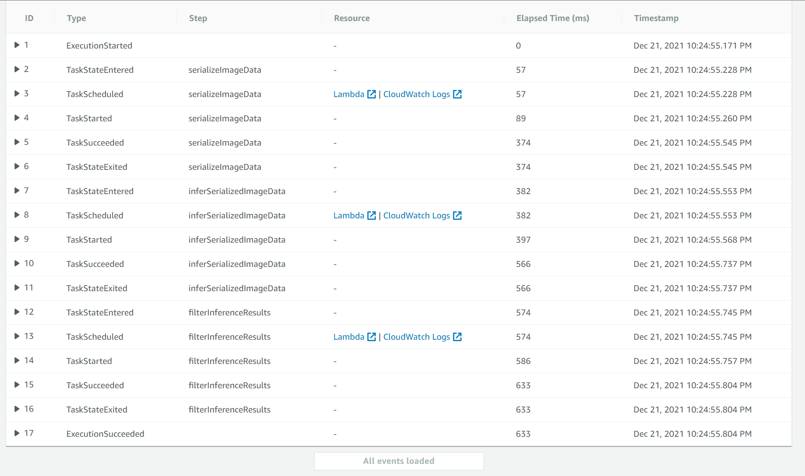

# Deploy and monitor a machine learning workflow for Image Classification

## AWS Machine Learning Engineer Nanodegree

## Overview

This project is a part of the Assessment in the Udacity's AWS Machine Learning Engineer Nanodegree Program.

## Getting Started

* Proceed with the project within the [jupyter notebook](SconesUnlimited.ipynb).

### Dependencies

```
Python 3.7
```

### Installation
For this project, it is highly recommended to use Sagemaker Studio from the course provided AWS workspace. This will simplify much of the installation needed to get started.

For local development, you will need to setup a jupyter lab instance.
* Follow the [jupyter install](https://jupyter.org/install.html) link for best practices to install and start a jupyter lab instance.
* If you have a python virtual environment already installed you can just `pip` install it.
```
pip install jupyterlab
```
* There are also docker containers containing jupyter lab from [Jupyter Docker Stacks](https://jupyter-docker-stacks.readthedocs.io/en/latest/index.html).

## Scones Unlimited

The motive of the project is to build a Machine Learning Model that performs image classification through ML workflows using Amazon's Sage Maker. The Step Functions 
linked with the lambda scripts are used to automate various tasks of Machine Learning process from Data Preparation, Model Creation, Model Deployment and Inference.

1. The [Serialoze Image Data Lambda Function](lambda%20functions/serializeImageData.py) takes the address of an image hosted in S3, then serializes and returns a JSON
object.
2. The [Infer Serialized Image Data](lambda%20functions/inferSerializedImageData.py) takes the JSON object returned from 1 and passes it to an end point and collectd the result
as a JSON Object.
3. The [Filter Results Lambda Function](lambda%20functions/filterResults.py) takes the inference data from 2 and filters only the images that meet the defined threshold.  

## Execution Flow of the Step Function 


## Step Functions Graph
 
## License
[License](LICENSE.txt)
